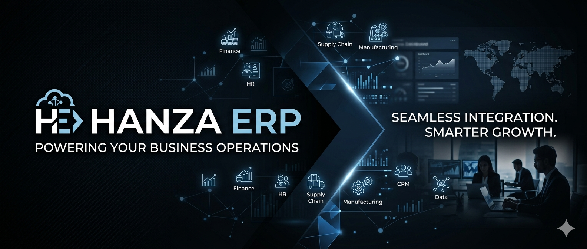
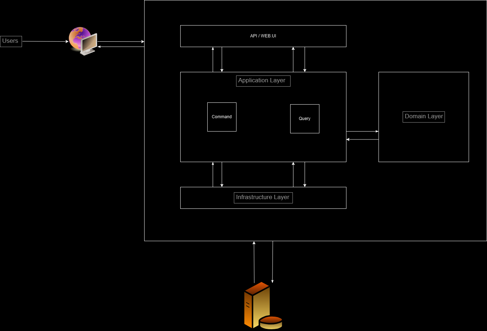
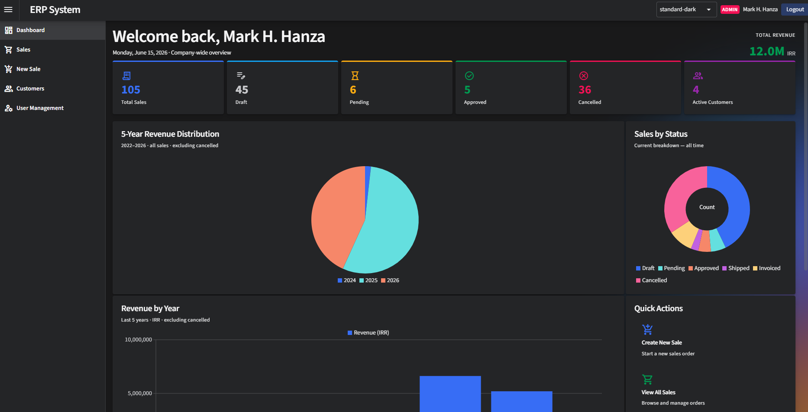
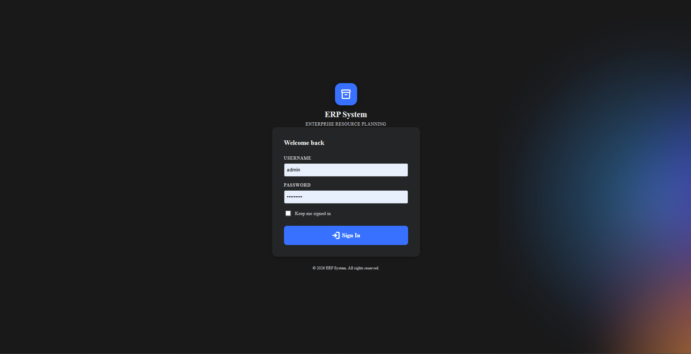

**# ERP System**

**A modern, modular Enterprise Resource Planning (ERP) application built with .NET**

  

## Overview

This ERP system is a comprehensive business management solution designed with clean architecture principles. It supports core business operations including customer management, sales processing, user administration, and dashboard analytics. The application is currently undergoing a migration from **MediatR** to **WolverineFx** for improved messaging, command handling, and background processing capabilities.

The architecture emphasizes **modularity**, **maintainability**, **scalability**, and **testability**, making it suitable for small to medium-sized businesses or as a foundation for larger enterprise deployments.

  


## Features

- **Customer Management**: CRUD operations, specifications-based querying, and domain-driven design for customers.
- **Sales Module**: Handling sales orders and related business logic.
- **User Management & Identity**: ASP.NET Core Identity integration for authentication and authorization.
- **Dashboard**: Real-time insights and analytics.
- **Modular Design**: Feature-based organization (Customers, Sales, Users, etc.).
- **CQRS & Messaging**: Powered by WolverineFx (post-migration) for commands, queries, and events.
- **Validation**: FluentValidation integration.
- **Persistence**: Entity Framework Core with SQL Server support and migrations.
- **UI**: Rich Blazor components using Radzen.Blazor library.

  

## Technology Stack

| Layer              | Technologies |
|--------------------|--------------|
| **Frontend**      | Blazor (Server/WebAssembly), Radzen.Blazor, HTML/CSS/JS |
| **Backend**       | .NET 10, C#  |
| **Architecture**  | Clean Architecture (Domain, Application, Infrastructure, WebUI), CQRS |
| **Messaging**     | WolverineFx (v6.8.0) + WolverineFx.RuntimeCompilation |
| **Validation**    | FluentValidation |
| **Database**      | Entity Framework Core, SQL Server (LocalDB configurable) |
| **Identity**      | Microsoft.AspNetCore.Identity.EntityFrameworkCore |
| **Other**         | SignalR Hubs (for real-time features), Dependency Injection |

**Key Dependencies**:
- WolverineFx ecosystem (core, EF Core, SQL Server, FluentValidation)
- Microsoft.EntityFrameworkCore.SqlServer
- Radzen.Blazor

## Project Structure

```
ERP/
├── ERP.Domain/              # Domain entities, value objects, enums, core business rules
├── ERP.Application/         # Application services, commands, queries, DTOs, specifications
├── ERP.Infrastructure/      # Persistence (EF Core DbContext, repositories), Identity, migrations
├── ERP.WebUI/               # Blazor frontend, Program.cs, components, wwwroot assets
├── ERP.SharedKernel/        # Shared utilities, exceptions, base classes
├── ERP.slnx                 # Solution file
└── ...
```

## Getting Started

### Prerequisites
- .NET 10 SDK
- SQL Server (LocalDB recommended for development)
- Visual Studio 2022/2023 or VS Code with C# Dev Kit

### Setup

1. **Clone the repository**
   ```bash
   git clone https://github.com/mortmccain/ERP.git
   cd ERP
   git checkout immigration-from-MediatR-to-wolverineFx-(initial)
   ```

2. **Update database connection** (if needed) in `ERP.WebUI/appsettings.json`

3. **Apply migrations**
   ```bash
   cd ERP.WebUI
   dotnet ef database update --project ../ERP.Infrastructure
   ```

4. **Run the application**
   ```bash
   dotnet run --project ERP.WebUI
   ```

   Or open `ERP.slnx` in Visual Studio and run the WebUI project.

  

## Migration Notes (MediatR → WolverineFx)

This branch represents the initial phase of migrating from MediatR to WolverineFx. Wolverine provides:
- Superior performance for message handling
- Built-in support for outbox, sagas, and durable messaging
- Better integration with EF Core
- Runtime compilation for rapid development

Existing MediatR handlers are being progressively replaced with Wolverine message handlers and endpoints.

## Contributing

Contributions are welcome! Please follow the existing architecture patterns:
- Keep domain logic pure (no infrastructure dependencies).
- Use specifications for complex queries.
- Add FluentValidation for command/query validation.
- Ensure proper Wolverine handler registration.

1. Fork the project
2. Create a feature branch
3. Submit a pull request

## License

This project is licensed under the MIT License - see the [LICENSE](LICENSE) file for details.

## Roadmap

- Complete WolverineFx migration
- Additional modules (Inventory, Accounting, HR)
- Advanced reporting and BI
- Multi-tenancy support
- API endpoints for external integrations
- Docker / containerization support

---

**Built with focus. using clean architecture and modern .NET practices.**

For questions or support, open an issue on GitHub.